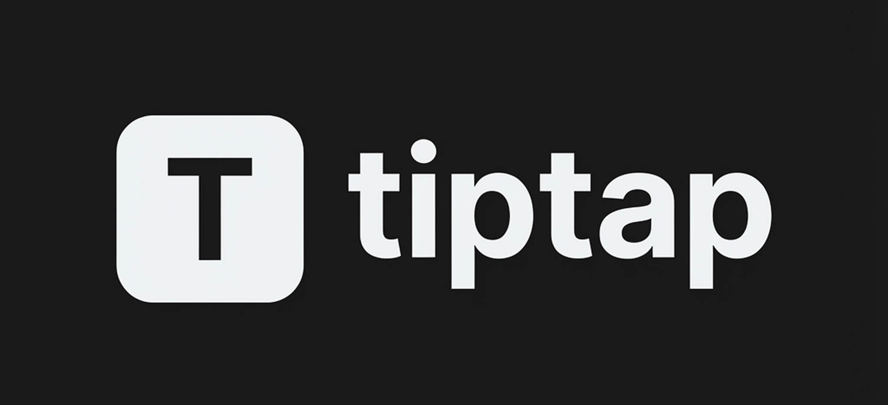

<div align="center">
  
  
  <h1>tiptap</h1>
  <p><strong>A beautiful rich text editor, made simple.</strong></p>
  
  <p>
    Free & open source rich text editor component. Zero config, one command setup.<br/>
    Built on <a href="https://tiptap.dev/">Tiptap</a>, styled with <a href="https://tailwindcss.com/">Tailwind</a>, works seamlessly with <a href="https://ui.shadcn.com/">shadcn/ui</a>.
  </p>
  
  <p>
    <a href="#">Get Started</a> •
    <a href="#">Installation</a> •
    <a href="#">Examples</a>
  </p>
</div>

---

> [!CAUTION]
> ### ⚠️ Under Development
> This project is currently in its early stages of development. **Expect breaking changes, bugs, and incomplete documentation.** It is not yet recommended for production use.

## Features

- 🎨 **Theme-aware** — Automatically adapts to light/dark mode with shadcn/ui theming
- 🎯 **Zero config** — Works out of the box with sensible defaults
- 📦 **shadcn/ui compatible** — Uses the same patterns, components, and styling conventions
- ✍️ **Rich text editing** — Bold, italic, underline, strikethrough, and inline code
- 📝 **Block formatting** — Headings (H1-H6), paragraphs, blockquotes, and horizontal rules
- 📋 **Lists** — Bullet lists and ordered lists with proper nesting
- 💻 **Code blocks** — Syntax highlighting with 30+ languages via lowlight
- 🖼️ **Image support** — Insert images with built-in media library widget
- 📊 **Tables** — Full table support with resizable columns, headers, and cell merging
- ⚡ **Slash commands** — Notion-style `/` menu for quick block insertion
- 🎯 **Text alignment** — Left, center, right, and justify alignment options
- 🔧 **Bubble menu** — Context-aware floating toolbar for text formatting
- ↩️ **History** — Undo/redo support with keyboard shortcuts
- 🧩 **Composable** — Build complex editors with simple, declarative components

## Installation

```bash
npx shadcn@latest add https://tiptap-seven.vercel.app/schema/tiptap.json
```

## Quick Start

```tsx
import { TiptapEditor, TiptapContent, TiptapToolbar } from "@/components/ui/tiptap"

export default function MyEditor() {
  return (
    <TiptapEditor content="<p>Hello World!</p>">
      <TiptapToolbar />
      <TiptapContent />
    </TiptapEditor>
  )
}
```

## Extensions Included

| Extension | Description |
|-----------|-------------|
| **StarterKit** | Core nodes (Document, Paragraph, Text, Heading, etc.) and marks (Bold, Italic, Strike, Code) |
| **Underline** | Underline text formatting |
| **TextAlign** | Text alignment (left, center, right, justify) |
| **Typography** | Automatic typographic improvements |
| **CodeBlockLowlight** | Code blocks with syntax highlighting |
| **Image** | Image insertion with validation options |
| **Table** | Tables with resizable columns and headers |
| **SlashMenu** | Notion-style slash commands |

## Contributing

Contributions are welcome! Please feel free to submit a Pull Request.

1. Fork the repository
2. Create your feature branch (`git checkout -b feature/amazing-feature`)
3. Commit your changes (`git commit -m 'Add some amazing feature'`)
4. Push to the branch (`git push origin feature/amazing-feature`)
5. Open a Pull Request

## License

MIT License - see the [LICENSE](LICENSE) file for details.